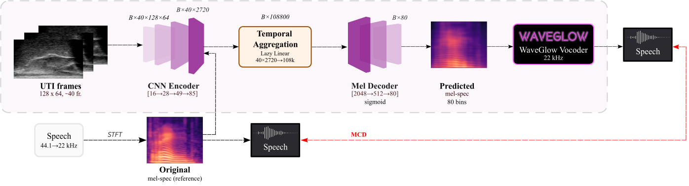
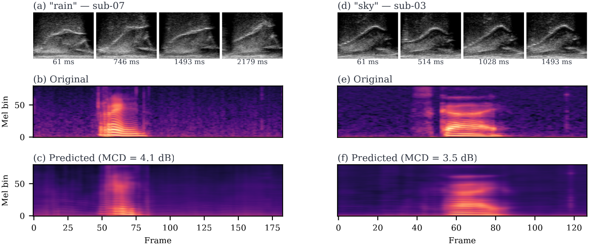

# Direct Articulatory-to-Acoustic Mapping from Ultrasound Tongue Imaging

Supplementary material for the manuscript

> **Direct Articulatory-to-Acoustic Mapping from Ultrasound Tongue Imaging**
> Frigyes Viktor Arthur and Dávid Sztahó
> Department of Telecommunications and Artificial Intelligence,
> Budapest University of Technology and Economics, Budapest, Hungary
> *Submitted to IEEE/ACM Transactions on Audio, Speech, and Language Processing.*

---

## Listen to the audio examples in your browser

Supplementary site:

### **<https://victorarthur.github.io/direct-aam-uti/>**

(GitHub's README sanitizer strips `<audio>`/`<video>` tags, so the players
are hosted on a static GitHub Pages page generated from `index.html` in
this same repository. The audio files and mel-spectrograms themselves
live under [`examples/`](examples/) and play with any browser's built-in
controls.)

---

## How the system works

Speech is **synthesised from a midsagittal ultrasound video of the tongue**.
A short window of ~40 raw ultrasound frames (~500 ms) is processed by a
convolutional encoder, aggregated, and decoded into an 80-channel
mel-spectrogram frame; a pre-trained WaveGlow vocoder then converts the
predicted mel-spectrogram into an audible waveform. The same vocoder is
applied to the natural-speech reference, so listening tests compare two
conditions that differ only in the AAM stage (matched-vocoder protocol).



Two example utterances and their model outputs are shown below: top rows are
the input UTI frames at four time-points within the utterance; below are the
original and predicted mel-spectrograms.



---

## Abstract

Articulatory-to-acoustic mapping (AAM) — reconstructing speech from articulator measurements — is a core building block for silent speech interfaces (SSIs). Most ultrasound tongue imaging (UTI)-based AAM systems predict classical vocoder parameters (MGC, LSP, F0) that require brittle voicing/pitch decisions and bypass modern neural waveform generators. We propose a temporal convolutional network that maps short windows of UTI frames directly to 80-channel mel-spectrograms, inverted to a waveform by a pre-trained WaveGlow vocoder. The system is trained and evaluated on a custom multimodal corpus of four speakers across three sessions each (1,200 utterances of isolated English words; Hungarian L1 / English L2). The same vocoder is applied to natural and predicted mel-spectrograms, so vocoder artifacts are shared across conditions and the evaluation isolates the AAM stage. With this matched-vocoder protocol the system reaches a mean Mel-Cepstral Distortion of 4.46 dB, with no significant inter-speaker differences (*p* = 0.838). A blinded 8-alternative forced-choice listening test with 31 listeners (1,240 trials, IEEE Std 1329 conformant) reaches 84.0% word recognition accuracy for synthesized speech against 99.7% for natural recordings (Cohen's *h* = 0.71), a Word Error Rate of 16.0%, macro-AUC of 0.895, and substantial inter-rater agreement (Fleiss' κ = 0.75). Recognition errors are phonetically structured and concentrate on minimal pairs such as *door*–*four*, consistent with the limited visibility of the tongue tip and lips in midsagittal UTI. The matched-vocoder protocol and the listener-response data are released, providing a reproducible reference point for UTI-based AAM and a foundation for cross-speaker pooling, continuous-speech extension, and target-population studies.

---

## Audio examples

<p><span style="display:inline-block;padding:0.15em 0.55em;background:#fff5eb;color:#cc5e00;border:1px solid #fb8500;border-radius:4px;font-weight:700">PREDICTED &mdash; synthesized from ultrasound</span> &nbsp; <span style="display:inline-block;padding:0.15em 0.55em;background:#ecfaf6;color:#1f7a6a;border:1px solid #2a9d8f;border-radius:4px;font-weight:700">ORIGINAL &mdash; natural recording</span></p>

**Click any spectrogram** to open the corresponding audio file on GitHub,
where the browser renders an inline audio player.

<a id="bring"></a>
### *bring*

#### sub-06 / ses-01

<table>
<tr><th style="background:#fff5eb;color:#cc5e00;border-top:3px solid #fb8500">PREDICTED &mdash; synthesized from ultrasound (click to play)</th><th style="background:#ecfaf6;color:#1f7a6a;border-top:3px solid #2a9d8f">ORIGINAL &mdash; natural recording (click to play)</th></tr>
<tr><td style="background:#fff5eb;border:2px solid #fb8500"><a href="examples/top12_sub-06_ses-01_bring_predicted.wav"></a></td><td style="background:#ecfaf6;border:2px solid #2a9d8f"><a href="examples/top12_sub-06_ses-01_bring_original.wav"></a></td></tr>
</table>

<a id="dance"></a>
### *dance*

#### sub-02 / ses-01

<table>
<tr><th style="background:#fff5eb;color:#cc5e00;border-top:3px solid #fb8500">PREDICTED &mdash; synthesized from ultrasound (click to play)</th><th style="background:#ecfaf6;color:#1f7a6a;border-top:3px solid #2a9d8f">ORIGINAL &mdash; natural recording (click to play)</th></tr>
<tr><td style="background:#fff5eb;border:2px solid #fb8500"><a href="examples/top07_sub-02_ses-01_dance_predicted.wav"></a></td><td style="background:#ecfaf6;border:2px solid #2a9d8f"><a href="examples/top07_sub-02_ses-01_dance_original.wav"></a></td></tr>
</table>

<a id="four"></a>
### *four*

#### sub-03 / ses-01

<table>
<tr><th style="background:#fff5eb;color:#cc5e00;border-top:3px solid #fb8500">PREDICTED &mdash; synthesized from ultrasound (click to play)</th><th style="background:#ecfaf6;color:#1f7a6a;border-top:3px solid #2a9d8f">ORIGINAL &mdash; natural recording (click to play)</th></tr>
<tr><td style="background:#fff5eb;border:2px solid #fb8500"><a href="examples/top14_sub-03_ses-01_four_predicted.wav"></a></td><td style="background:#ecfaf6;border:2px solid #2a9d8f"><a href="examples/top14_sub-03_ses-01_four_original.wav"></a></td></tr>
</table>

<a id="laugh"></a>
### *laugh*

#### sub-06 / ses-02

<table>
<tr><th style="background:#fff5eb;color:#cc5e00;border-top:3px solid #fb8500">PREDICTED &mdash; synthesized from ultrasound (click to play)</th><th style="background:#ecfaf6;color:#1f7a6a;border-top:3px solid #2a9d8f">ORIGINAL &mdash; natural recording (click to play)</th></tr>
<tr><td style="background:#fff5eb;border:2px solid #fb8500"><a href="examples/top04_sub-06_ses-02_laugh_predicted.wav"></a></td><td style="background:#ecfaf6;border:2px solid #2a9d8f"><a href="examples/top04_sub-06_ses-02_laugh_original.wav"></a></td></tr>
</table>

<a id="rain"></a>
### *rain*

#### sub-03 / ses-01

<table>
<tr><th style="background:#fff5eb;color:#cc5e00;border-top:3px solid #fb8500">PREDICTED &mdash; synthesized from ultrasound (click to play)</th><th style="background:#ecfaf6;color:#1f7a6a;border-top:3px solid #2a9d8f">ORIGINAL &mdash; natural recording (click to play)</th></tr>
<tr><td style="background:#fff5eb;border:2px solid #fb8500"><a href="examples/top09_sub-03_ses-01_rain_predicted.wav"></a></td><td style="background:#ecfaf6;border:2px solid #2a9d8f"><a href="examples/top09_sub-03_ses-01_rain_original.wav"></a></td></tr>
</table>

<a id="sad"></a>
### *sad* &mdash; 3 examples

#### sub-03 / ses-01

<table>
<tr><th style="background:#fff5eb;color:#cc5e00;border-top:3px solid #fb8500">PREDICTED &mdash; synthesized from ultrasound (click to play)</th><th style="background:#ecfaf6;color:#1f7a6a;border-top:3px solid #2a9d8f">ORIGINAL &mdash; natural recording (click to play)</th></tr>
<tr><td style="background:#fff5eb;border:2px solid #fb8500"><a href="examples/top01_sub-03_ses-01_sad_predicted.wav"></a></td><td style="background:#ecfaf6;border:2px solid #2a9d8f"><a href="examples/top01_sub-03_ses-01_sad_original.wav"></a></td></tr>
</table>

#### sub-06 / ses-02

<table>
<tr><th style="background:#fff5eb;color:#cc5e00;border-top:3px solid #fb8500">PREDICTED &mdash; synthesized from ultrasound (click to play)</th><th style="background:#ecfaf6;color:#1f7a6a;border-top:3px solid #2a9d8f">ORIGINAL &mdash; natural recording (click to play)</th></tr>
<tr><td style="background:#fff5eb;border:2px solid #fb8500"><a href="examples/top02_sub-06_ses-02_sad_predicted.wav"></a></td><td style="background:#ecfaf6;border:2px solid #2a9d8f"><a href="examples/top02_sub-06_ses-02_sad_original.wav"></a></td></tr>
</table>

#### sub-06 / ses-01

<table>
<tr><th style="background:#fff5eb;color:#cc5e00;border-top:3px solid #fb8500">PREDICTED &mdash; synthesized from ultrasound (click to play)</th><th style="background:#ecfaf6;color:#1f7a6a;border-top:3px solid #2a9d8f">ORIGINAL &mdash; natural recording (click to play)</th></tr>
<tr><td style="background:#fff5eb;border:2px solid #fb8500"><a href="examples/top03_sub-06_ses-01_sad_predicted.wav"></a></td><td style="background:#ecfaf6;border:2px solid #2a9d8f"><a href="examples/top03_sub-06_ses-01_sad_original.wav"></a></td></tr>
</table>

<a id="sky"></a>
### *sky*

#### sub-02 / ses-01

<table>
<tr><th style="background:#fff5eb;color:#cc5e00;border-top:3px solid #fb8500">PREDICTED &mdash; synthesized from ultrasound (click to play)</th><th style="background:#ecfaf6;color:#1f7a6a;border-top:3px solid #2a9d8f">ORIGINAL &mdash; natural recording (click to play)</th></tr>
<tr><td style="background:#fff5eb;border:2px solid #fb8500"><a href="examples/top05_sub-02_ses-01_sky_predicted.wav"></a></td><td style="background:#ecfaf6;border:2px solid #2a9d8f"><a href="examples/top05_sub-02_ses-01_sky_original.wav"></a></td></tr>
</table>

---

A plain-text index of the same audio examples is also available in
[`examples/INDEX.md`](examples/INDEX.md).

---

## Matched-vocoder evaluation protocol

A central methodological contribution of this work is the **matched-vocoder
evaluation protocol**: in the listening test, both the predicted and the
natural mel-spectrograms are inverted by the **same** pre-trained WaveGlow
vocoder. This ensures that any artefact introduced by the waveform generator
is shared across the two conditions and that any difference in listener
recognition reflects only the quality of the UTI-to-mel-spectrogram
prediction. We propose this design as a default for comparing future
UTI-based AAM systems on heterogeneous datasets.

---

## Repository layout

```
direct-aam-uti/
├── README.md this file (mel images embedded; click to play audio)
├── index.html supplementary site (GitHub Pages, inline players)
├── LICENSE CC BY 4.0
├── CITATION.cff machine-readable citation metadata
├── .gitignore
├── figures/
│ ├── pipeline.png
│ └── data_results.png
└── examples/
 ├── INDEX.md
 ├── topNN_<spk>_<ses>_<word>_predicted.wav (5 files)
 ├── topNN_<spk>_<ses>_<word>_original.wav (5 files)
 ├── topNN_<spk>_<ses>_<word>_predicted_mel.png (5 files)
 └── topNN_<spk>_<ses>_<word>_original_mel.png (5 files)
```

---

## How to cite

Until the article is published, please cite this repository directly via the
GitHub "Cite this repository" button (powered by the `CITATION.cff` file in
the root) or use the placeholder BibTeX entry below:

```bibtex
@unpublished{arthur2026directaam,
 author = {Arthur, Frigyes Viktor and Sztah{\'{o}}, D{\'{a}}vid},
 title = {Direct Articulatory-to-Acoustic Mapping from Ultrasound Tongue Imaging},
 year = {2026},
 note = {Manuscript submitted to IEEE/ACM Transactions on Audio, Speech, and Language Processing.}
}
```

A final BibTeX entry will be added here once the article is accepted.

---

## License

Unless otherwise stated, the contents of this repository are released under
[**Creative Commons Attribution 4.0 International (CC BY 4.0)**](https://creativecommons.org/licenses/by/4.0/).
You are free to share and adapt the material for any purpose, provided
appropriate credit is given to the authors and the article is cited.

The audio recordings included in `examples/` were collected with the written
informed consent of the four speakers; consent covers public release of these
specific stimuli for the purpose of accompanying scientific publications.

---

## Acknowledgements

This research was supported by the National Research, Development and
Innovation Office of Hungary (project FK 142163). Frigyes Viktor Arthur
acknowledges the financial support of the ÚNKP-22-2-I-BME-352 New National
Excellence Program of the Ministry for Culture and Innovation from the source
of the National Research, Development and Innovation Fund.

We dedicate this work to the memory of **Tamás Gábor Csapó**, whose vision
and leadership were instrumental in initiating this research.

---

## Contact

Frigyes Viktor Arthur
Department of Telecommunications and Artificial Intelligence,
Budapest University of Technology and Economics, Budapest, Hungary
arthur@tmit.bme.hu