# Audio examples

PREDICTED &mdash; synthesized from ultrasound &nbsp; ORIGINAL &mdash; natural recording

Click any mel-spectrogram below to open the corresponding audio file on
GitHub, where the browser renders an inline audio player.

## *bring*

### sub-06 / ses-01

<table>
<tr><th style="background:#fff5eb;color:#cc5e00;border-top:3px solid #fb8500">PREDICTED &mdash; synthesized from ultrasound (click to play)</th><th style="background:#ecfaf6;color:#1f7a6a;border-top:3px solid #2a9d8f">ORIGINAL &mdash; natural recording (click to play)</th></tr>
<tr><td style="background:#fff5eb;border:2px solid #fb8500"><a href="top12_sub-06_ses-01_bring_predicted.wav">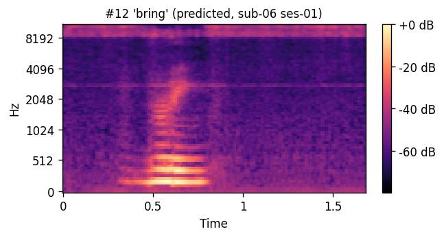</a></td><td style="background:#ecfaf6;border:2px solid #2a9d8f"></td></tr>
</table>

## *dance*

### sub-02 / ses-01

<table>
<tr><th style="background:#fff5eb;color:#cc5e00;border-top:3px solid #fb8500">PREDICTED &mdash; synthesized from ultrasound (click to play)</th><th style="background:#ecfaf6;color:#1f7a6a;border-top:3px solid #2a9d8f">ORIGINAL &mdash; natural recording (click to play)</th></tr>
<tr><td style="background:#fff5eb;border:2px solid #fb8500"><a href="top07_sub-02_ses-01_dance_predicted.wav">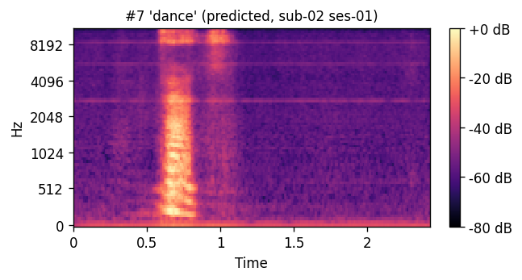</a></td><td style="background:#ecfaf6;border:2px solid #2a9d8f"><a href="top07_sub-02_ses-01_dance_original.wav">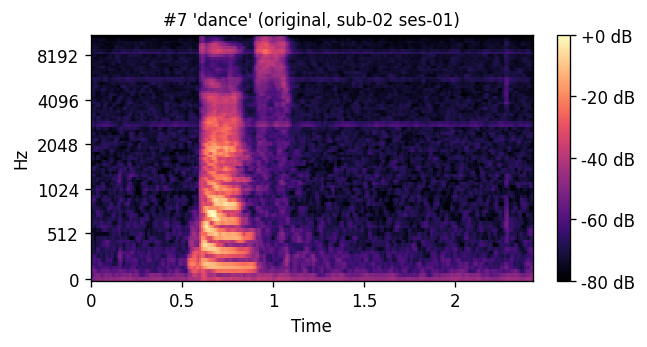</a></td></tr>
</table>

## *four*

### sub-03 / ses-01

<table>
<tr><th style="background:#fff5eb;color:#cc5e00;border-top:3px solid #fb8500">PREDICTED &mdash; synthesized from ultrasound (click to play)</th><th style="background:#ecfaf6;color:#1f7a6a;border-top:3px solid #2a9d8f">ORIGINAL &mdash; natural recording (click to play)</th></tr>
<tr><td style="background:#fff5eb;border:2px solid #fb8500"><a href="top14_sub-03_ses-01_four_predicted.wav">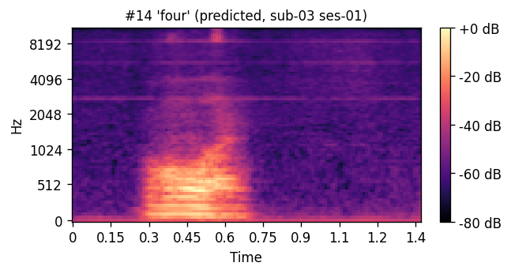</a></td><td style="background:#ecfaf6;border:2px solid #2a9d8f"><a href="top14_sub-03_ses-01_four_original.wav">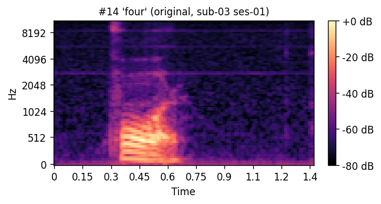</a></td></tr>
</table>

## *laugh*

### sub-06 / ses-02

<table>
<tr><th style="background:#fff5eb;color:#cc5e00;border-top:3px solid #fb8500">PREDICTED &mdash; synthesized from ultrasound (click to play)</th><th style="background:#ecfaf6;color:#1f7a6a;border-top:3px solid #2a9d8f">ORIGINAL &mdash; natural recording (click to play)</th></tr>
<tr><td style="background:#fff5eb;border:2px solid #fb8500"><a href="top04_sub-06_ses-02_laugh_predicted.wav">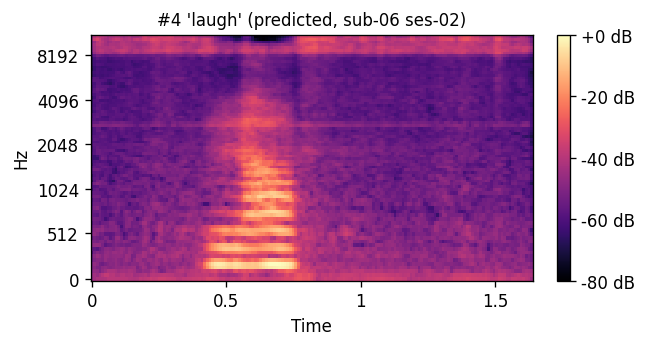</a></td><td style="background:#ecfaf6;border:2px solid #2a9d8f"><a href="top04_sub-06_ses-02_laugh_original.wav">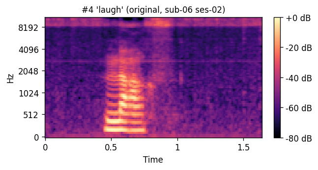</a></td></tr>
</table>

## *rain*

### sub-03 / ses-01

<table>
<tr><th style="background:#fff5eb;color:#cc5e00;border-top:3px solid #fb8500">PREDICTED &mdash; synthesized from ultrasound (click to play)</th><th style="background:#ecfaf6;color:#1f7a6a;border-top:3px solid #2a9d8f">ORIGINAL &mdash; natural recording (click to play)</th></tr>
<tr><td style="background:#fff5eb;border:2px solid #fb8500"><a href="top09_sub-03_ses-01_rain_predicted.wav">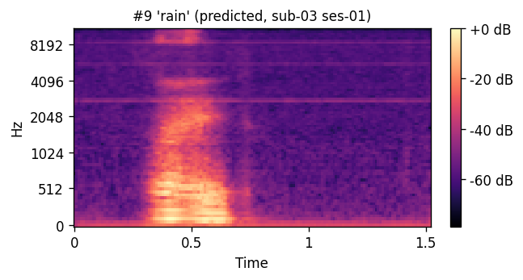</a></td><td style="background:#ecfaf6;border:2px solid #2a9d8f"><a href="top09_sub-03_ses-01_rain_original.wav">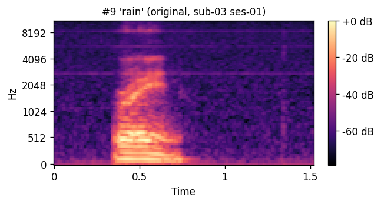</a></td></tr>
</table>

## *sad* — 3 examples

### sub-03 / ses-01

<table>
<tr><th style="background:#fff5eb;color:#cc5e00;border-top:3px solid #fb8500">PREDICTED &mdash; synthesized from ultrasound (click to play)</th><th style="background:#ecfaf6;color:#1f7a6a;border-top:3px solid #2a9d8f">ORIGINAL &mdash; natural recording (click to play)</th></tr>
<tr><td style="background:#fff5eb;border:2px solid #fb8500"><a href="top01_sub-03_ses-01_sad_predicted.wav">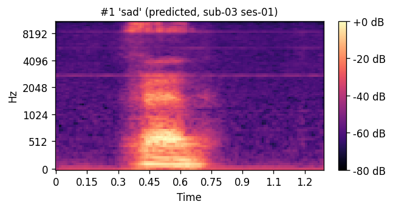</a></td><td style="background:#ecfaf6;border:2px solid #2a9d8f"><a href="top01_sub-03_ses-01_sad_original.wav">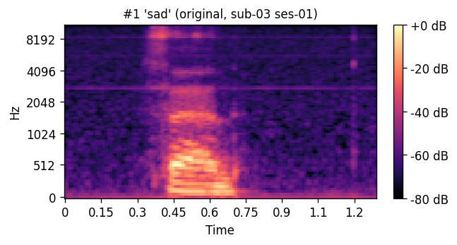</a></td></tr>
</table>

### sub-06 / ses-02

<table>
<tr><th style="background:#fff5eb;color:#cc5e00;border-top:3px solid #fb8500">PREDICTED &mdash; synthesized from ultrasound (click to play)</th><th style="background:#ecfaf6;color:#1f7a6a;border-top:3px solid #2a9d8f">ORIGINAL &mdash; natural recording (click to play)</th></tr>
<tr><td style="background:#fff5eb;border:2px solid #fb8500"><a href="top02_sub-06_ses-02_sad_predicted.wav">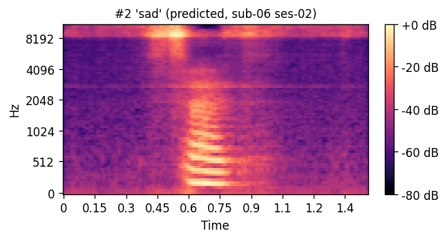</a></td><td style="background:#ecfaf6;border:2px solid #2a9d8f"><a href="top02_sub-06_ses-02_sad_original.wav">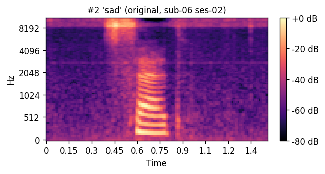</a></td></tr>
</table>

### sub-06 / ses-01

<table>
<tr><th style="background:#fff5eb;color:#cc5e00;border-top:3px solid #fb8500">PREDICTED &mdash; synthesized from ultrasound (click to play)</th><th style="background:#ecfaf6;color:#1f7a6a;border-top:3px solid #2a9d8f">ORIGINAL &mdash; natural recording (click to play)</th></tr>
<tr><td style="background:#fff5eb;border:2px solid #fb8500"><a href="top03_sub-06_ses-01_sad_predicted.wav">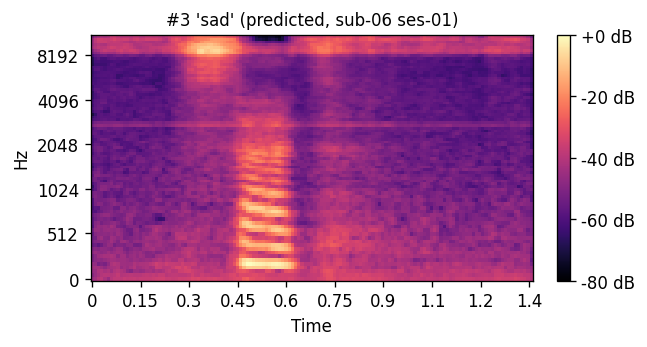</a></td><td style="background:#ecfaf6;border:2px solid #2a9d8f"><a href="top03_sub-06_ses-01_sad_original.wav">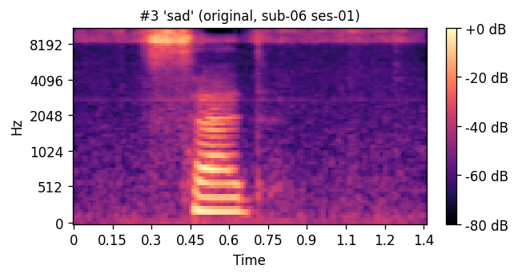</a></td></tr>
</table>

## *sky*

### sub-02 / ses-01

<table>
<tr><th style="background:#fff5eb;color:#cc5e00;border-top:3px solid #fb8500">PREDICTED &mdash; synthesized from ultrasound (click to play)</th><th style="background:#ecfaf6;color:#1f7a6a;border-top:3px solid #2a9d8f">ORIGINAL &mdash; natural recording (click to play)</th></tr>
<tr><td style="background:#fff5eb;border:2px solid #fb8500"><a href="top05_sub-02_ses-01_sky_predicted.wav">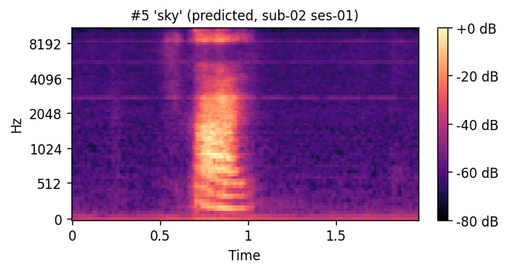</a></td><td style="background:#ecfaf6;border:2px solid #2a9d8f"><a href="top05_sub-02_ses-01_sky_original.wav">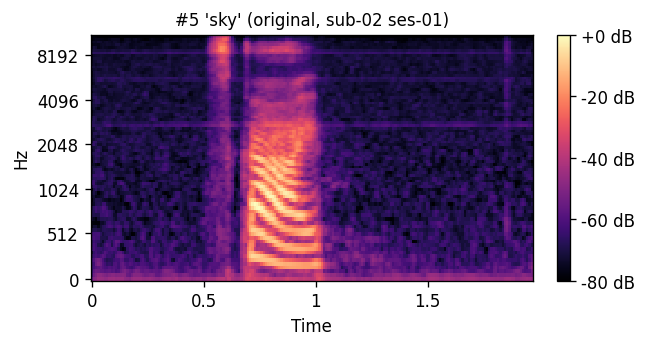</a></td></tr>
</table>

---

## How to listen

Download the `.wav` files and play them with any media player; audio is
mono, sampled at 22,050 Hz. The `_predicted` and `_original` files in
each pair correspond to the same underlying utterance and were judged in
randomized, blinded order during the listening test described in the article.

## How to read the mel-spectrograms

Each `_mel.png` figure shows the 80-channel log-mel-spectrogram with
time on the horizontal axis and mel-frequency on the vertical axis.
Within each pair (predicted/original) the colour scale is matched, so
visual differences reflect AAM-stage quality only.